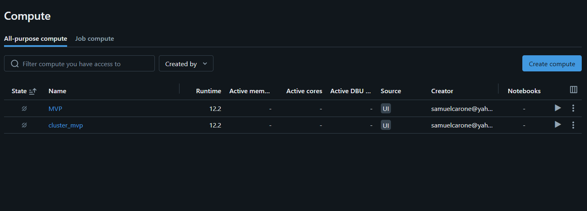
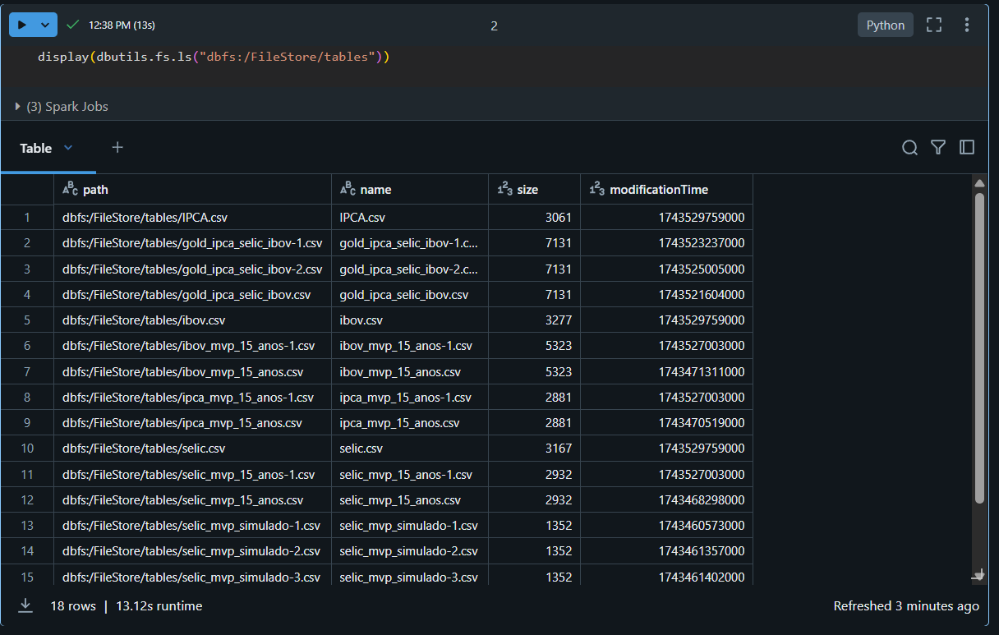
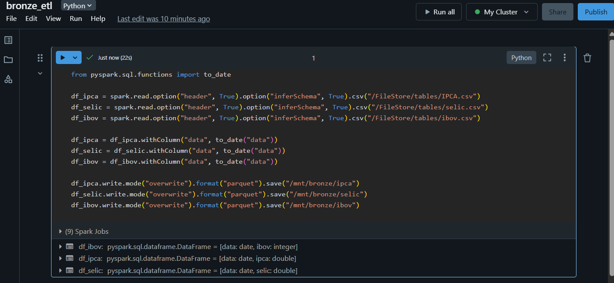
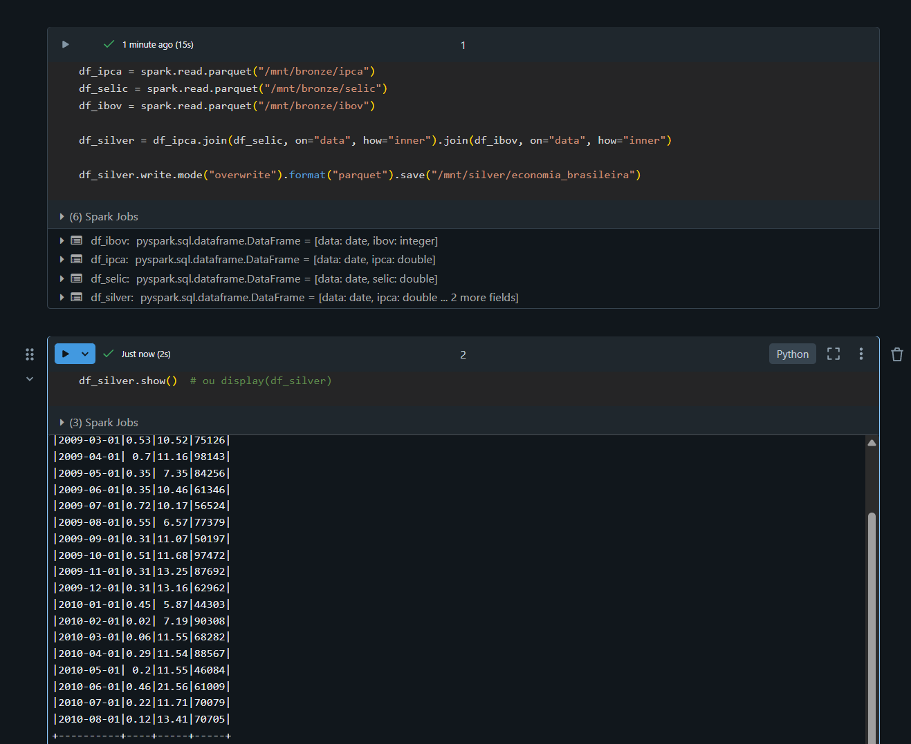
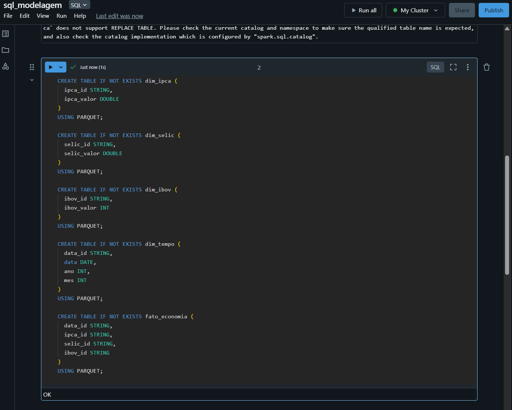
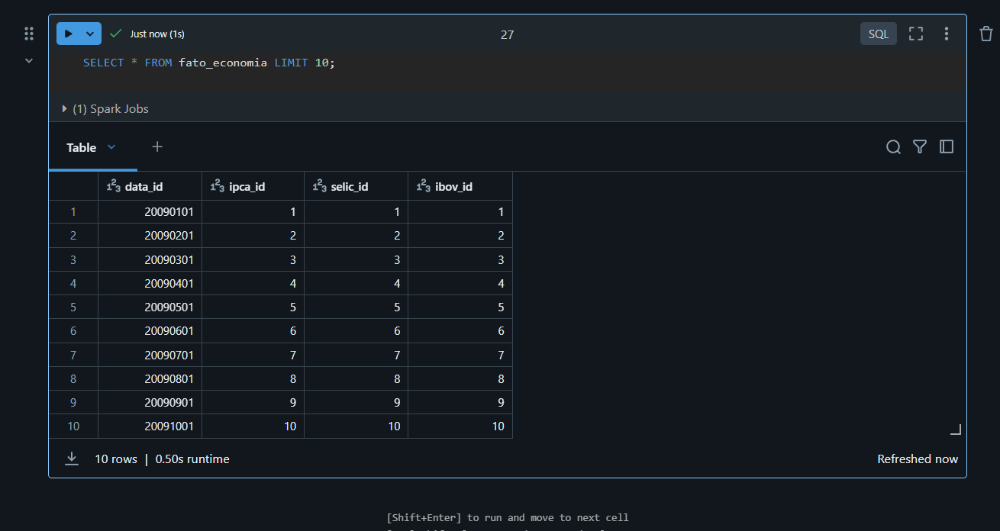
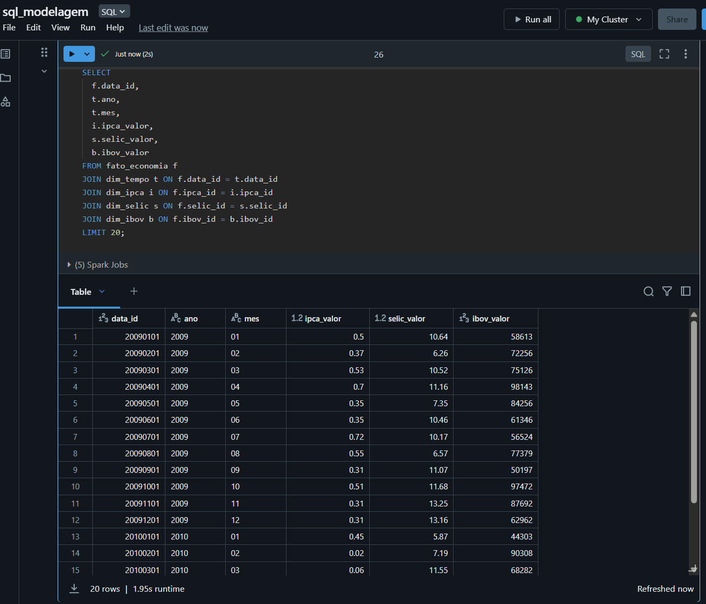
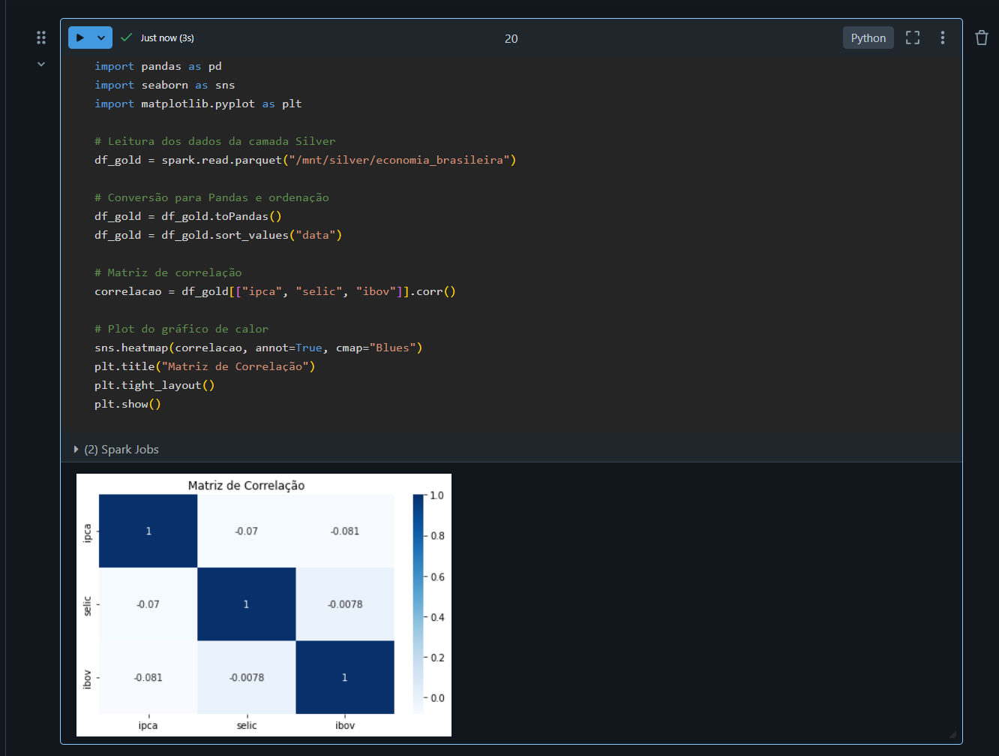

# 📸 Prints - Item 7: Consultas SQL com JOINs

Este diretório contém os prints das etapas do Item 7 do MVP de Engenharia de Dados (PUC-Rio), que trata das consultas SQL com JOINs entre tabelas fato e dimensões no Databricks.

---

### ✅ 1. Cluster Ativo
📎 

---

### ✅ 2. Upload dos Arquivos CSV
📎 

---

### ✅ 3. Execução da Camada Bronze
📎 

---

### ✅ 4. Execução da Camada Silver
📎 

---

### ✅ 5. Criação das Tabelas SQL
📎 

---

### ✅ 6. Tabela `fato_economia` Populada
📎 

---

### ✅ 7. Resultado da Consulta com JOIN
📎 

---

### ✅ 8. Matriz de Correlação
📎 
