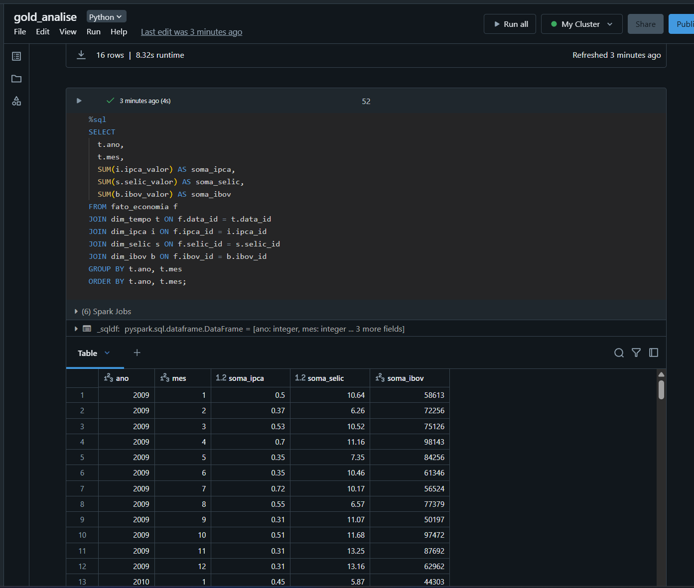
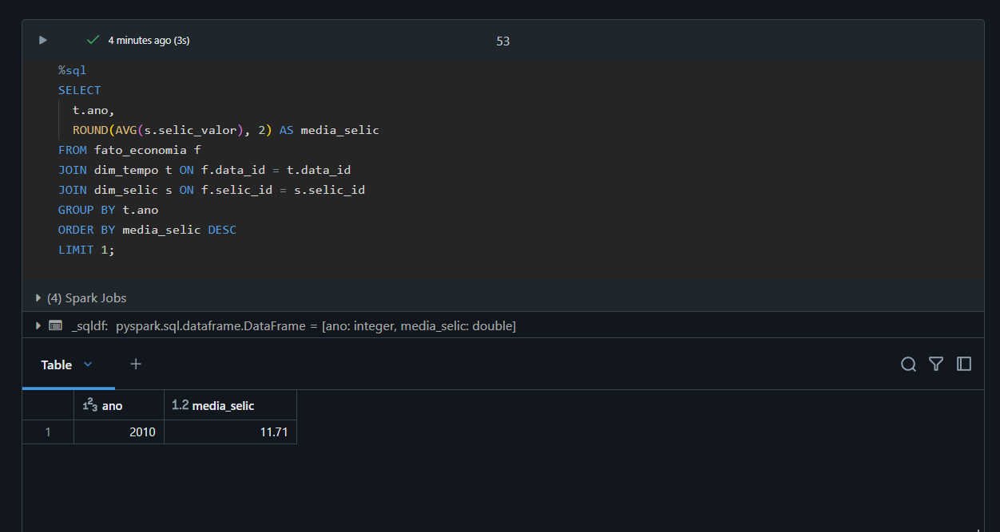
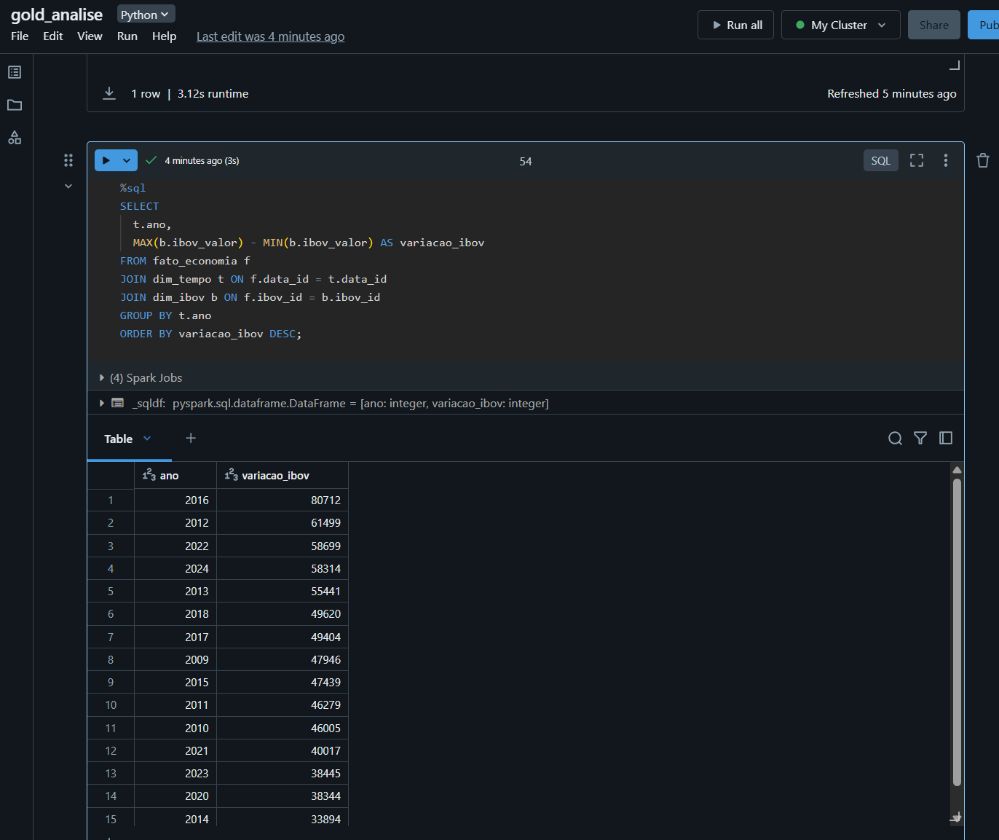

# 📊 Item 8 – Análise dos Dados com SQL

As consultas a seguir foram realizadas usando apenas SQL, conforme solicitado, e envolvem análises de IPCA, SELIC e IBOVESPA a partir da tabela fato `fato_economia` e suas respectivas dimensões.

---

## 1. Média Anual de IPCA, SELIC e IBOV
Consulta para analisar a média de cada indicador por ano.

📎 

---

## 2. Soma Mensal por Ano
Consulta que retorna a soma dos indicadores por ano e mês, útil para observar sazonalidade.

📎 

---

## 3. Ano com Maior SELIC Média
Identifica o ano com maior taxa média de juros no período analisado.

📎 

---

## 4. Variação Anual do IBOVESPA
Calcula a variação anual do IBOV (máx - mín) para entender volatilidade.

📎 
